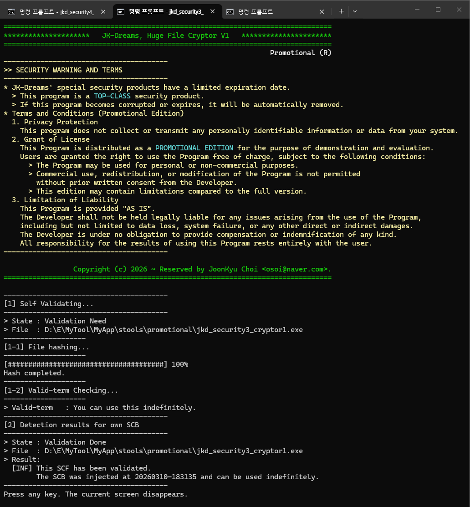

# 블로그 게시물 작성

본 문서는 [개인 블로그 사이트](https://blog.jk-dreams.com/) 게시용 정보를 보관한 것이다.



## Title
JK_SecurityTools V1

## Excerpt
Security Library and Tools (package)  
보안 라이브러리와 툴 (Package)

## Tag
products

## 개발 기간
```
- 개발기간
  [2026.03.19 ~ 2026.03.20] GitHub 공개
  [2026.01.03 ~ 2026.03.12] V1개발 완료
- 개발언어
  > C/C++/VC++
- 데이터관리
  > None
- 통신
  > None
```

## 설명
본 게시물은 파일에 보안을 적용시킬 수 있는 라이브러리와 툴(Apps)로 이루어진, Windows 시스템용 패키지를 홍보합니다.  
기본적으로 파일의 **데이터 무결성을 보장**하며, **대용량 파일 암복호**와 부수적으로 **패스워드·유효기간** 지정과, **사용 횟수**를 제한할 수 있습니다.  
여기에서, 파일은 실행가능한 파일(exe, dll)과 일반적인 데이터 파일을 모두 포함합니다.  

이미 널리 알려진, Microsoft Windows SDK에 포함된 **SignTool.exe**과 유사하지만, 기업 운영에 필요한 더 많은 보안 기능을 제공하기 위해, 설계하여 개발하였습니다.  
기업용과 홍보용으로 분리하여 개발되었으며, 홍보용을 [GitHub](https://github.com/JoonkyuChoi/JK_SecurityTools_V1)에 공개하였습니다.  

홍보용이지만, 개인적·비상업적 목적으로, 자유롭게 사용할 수 있습니다.
