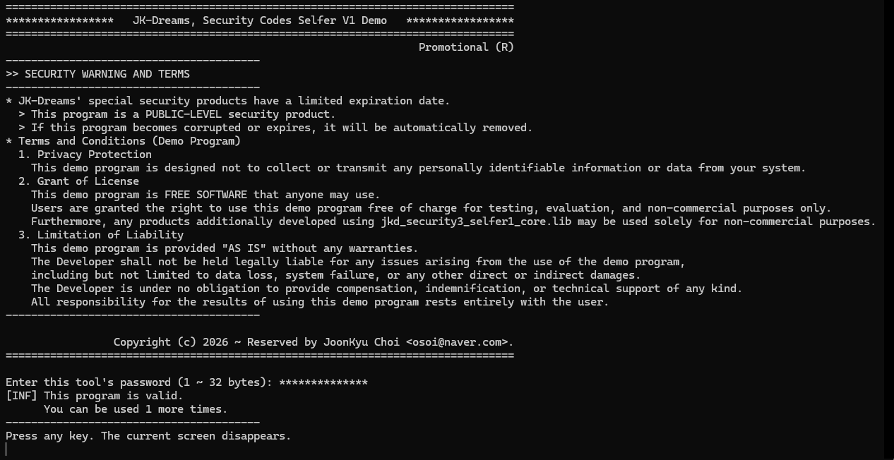
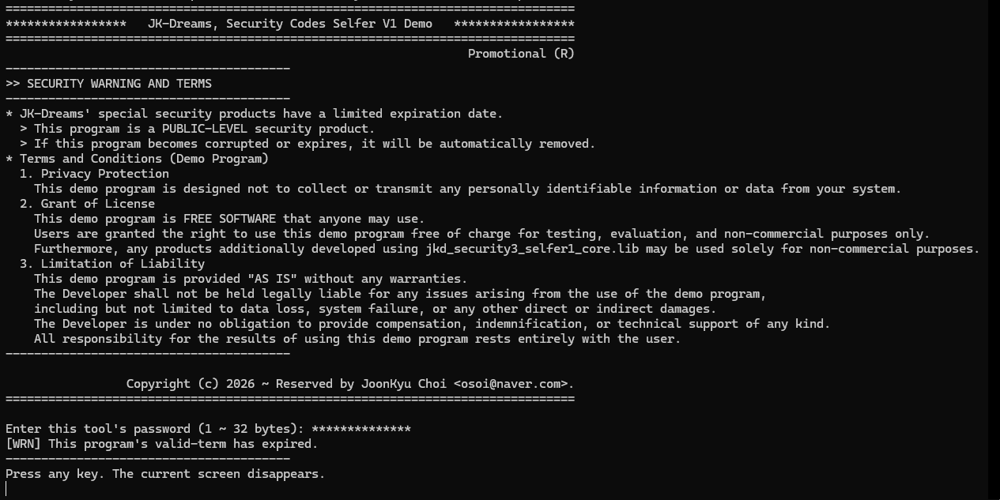

# 자체검증 3급 보안 라이브러리 (jkd_security3_selfer1_core.lib) 사용 예제


## 목차
- [용어 정의](#용어-정의)
- [개발 목적](#개발-목적)
  - [jkd_security3_selfer1_core.lib](#jkd_security3_selfer1_corelib)
  - [selfer1_example.exe](#selfer1_exampleexe)
- [보안툴 기본 속성](#보안툴-기본-속성)
- [기업용/홍보용 차이점](#기업용홍보용-차이점)
- [캡쳐 화면들](#캡쳐-화면들)
  - [자체 검증 유효 화면](#자체-검증-유효-화면)
  - [자체 검증 만료 화면](#자체-검증-만료-화면)
- [라이센스](#라이센스)


## 용어 정의
```
SCF   : 보안코드 파일 (SCB를 내장한 파일)
SCB   : 보안코드 블록 (SCF에 내장된 코드 블록)
```


## 개발 목적

### jkd_security3_selfer1_core.lib
`자체검증 3급 보안 라이브러리 (jkd_security3_selfer1_core.lib)`는 개인사업자의 `실행 가능한 이진코드 파일들(dll, exe)`을 보호하기 위한 목적으로 개발되었다.</br>
SCB가 내장된 파일이 외부적인 요인으로 손상되었다면, 즉시 실행을 종료하게 된다.</br>
사실, 프로그램을 종료할지, 자체 소멸시킬지는 제공되는 함수들을 활용하면 된다.</br>
그 수행 절차는 [main.cpp](src/main.cpp) 파일을 분석하라.
  - 라이브러리 파일은 MT로 빌드되었으며, [libs](libs/) 폴더에 모드별로 존재한다.

`자체검증 3급 보안 라이브러리`를 C++ 프로젝트에 내장시켜 빌드하면, SCB를 내장하게 되고 제공하는 함수들로, 자체 검증을 수행할 수 있다.</br>
  - 빌드하여 내장된 SCB는 비활성 상태이기에, 3급 주입툴(jkd_security3_injector1.exe)로 SCB를 활성화 시켜야 한다.</br>
    SCB 주입 방법은 [TestSheet](docs/TestSheet-Release.md#테스트) 파일을 참조하라.
  - 제공 함수들은 [SCP.h](src/include/scp-self/SCP.h) 파일을 참조하라.

자체 검증은 기본적으로, **데이터 무결성을 검증**하며, 부가적으로 `사용횟수, 유효기간, 패스워드`가 설정되었다면, `확인/요청`하게 된다.

Microsoft Windows SDK에 포함된 `SignTool.exe`과 유사하지만, 더 많은 보안 기능을 제공하기 위해, 직접 설계하여 개발하였다.</br>
최고 수준의 보안 알고리즘을 적용하였으며, 상세한 설계 내역은 보안을 위해 금지한다.

### selfer1_example.exe
`자체검증 3급 보안 라이브러리 (jkd_security3_selfer1_core.lib)`를 내장시켜, 제공된 함수들로 구현한, Demo용 콘솔 프로그램이다.</br>
MSVC2008로 제작하였으며, 그 이상의 버전에서 빌드할 수 있다.
  - 솔루션 파일은 [build/msvc2008/selfer1_example.sln](build/msvc2008/selfer1_example.sln) 경로에 존재한다.
  - 프로젝트 설정은 [msvc-settings](msvc-settings.md) 파일을 참조하라.
  - 빌드된 파일들은 [bin/Debug](bin/Debug/)와 [bin/Release](bin/Release/) 경로에 생성된다.
  - SCB를 주입하여 활성화시키고, 테스트하려면 [docs](docs/) 폴더의 문서를 역으로(최하단에서 상단으로) 수행하라.


## 보안툴 기본 속성
모든 SCF는 `자체검증` 기능을 내장하고, 최우선으로 수행한다.
- 보안툴의 기본 기능은 **데이터 무결성 검증**이 목적이다.</br>
  특히, 대용량 파일에 적합하도록 설계되었다.
- SCF의 최초 상태는 SCB 비활성 상태로써, 실행하면 즉시 종료된다.</br>
  홍보용은 이미 활성화된 상태로 설정하여 배포한 것이다.
- SCB가 주입되면, 활성화 되었다고 표현하며, 실행하면 자체검증을 최우선으로 수행하여, 자신의 무결성을 확인한다.</br>
  자체검증에서, 데이터가 손상되었다면, 즉시 종료된다.
- 한번 주입된 SCF에, SCB를 재주입 시킬 수 없다.</br>
  한번 활성화된 SCF는 SCB 변경을 허락하지 않는다.
- 유효 기간</br>
  모든 2급 이하의 보안툴은 [사용기간]을 설정하여, 시간이 만료되면 종료하도록 제한되어 있다.</br>
  이런 이유로, 홍보용은 특별히 [무기한] 설정이 가능한, 3급 이상으로 설정하여 배포된다.
  - [사용횟수]는 부가 기능으로, 주입자의 선택 사항일 뿐이다.
  - [사용:기간/횟수] 중에, 하나만 만족하게 된다면, 보안툴(파일)은 자체 소멸한다.
- Passwords</br>
  - 대상 파일에 SCB를 주입하거나 파일을 암호화시킬 때, [패스워드]를 설정할 수 있다.</br>
    패스워드는 옵션이지만, 노출된 곳에서 사용하는 경우라면, 반드시 설정할 것을 권장한다.</br>
    홍보용은 공개 버전이기에, 패스워드 설정이 무의미하여, 설정하지 않은 상태로 배포된다.
  - 패스워드가 설정된 SCF는 자체검증마다, 패스워드 입력을 요청한다.
    > 암호화툴로 암호화된 파일에 패스워드를 설정한 상태에서, 다시 복호화를 시도한 경우,</br>
      기본적으로 3회 입력을 실패하면, 암호화된 파일은 `Locked` 상태가 되어, 복호화할 수 없게 된다.</br>
      하지만, 홍보용은 암호화툴이 종료될 뿐, 암호화된 파일을 `Locked` 상태로 만들지 않는다.


## 기업용/홍보용 차이점
기업용은 총 9가지 툴로 이루어져 있으며, 그 중에 5가지를 홍보용으로 제작하여 공개한 것이다.</br>
기업용은 보안등급에 따라, 기능에 엄격한 제한이 있으며, 홍보용은 3급 이상으로 배포된다.

홍보용은 공개용으로 배포하기에, `패스워드, 사용횟수, 유효기간`이 무의미하여, 보안을 낮추어 설정한 버전이다.</br>
하지만, 사용자가 제작한 프로그램에는 3급 주입툴(jkd_security3_injector1.exe)로, 직접 자유롭게 설정할 수 있다.

본 데모 프로그램을 빌드한 결과 파일에, 직접 테스트하면서 각 기능에 익숙해 질 것이다.


## 캡쳐 화면들

### 자체 검증 유효 화면
패스워드 지정, 사용횟수 1회로 주입된 자체검증 유효 화면이다.</br>


### 자체 검증 만료 화면
패스워드 지정, 사용횟수 1회로 주입된 자체검증 만료 화면이다.</br>
해당 예제는 만료되면, 자체 소멸하도록 처리하였다.</br>



## 라이센스
본 데모는 무료로 사용할 수 있지만, 사용자가 `jkd_security3_selfer1_core.lib`를 이용하여, 추가적으로 개발한 제품은 비상업적 목적으로만 사용할 수 있다.
