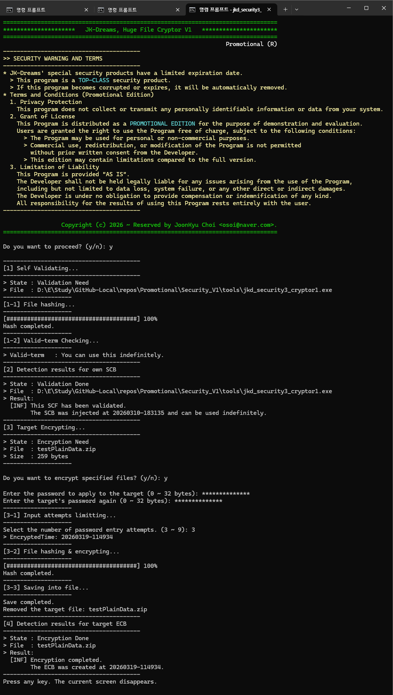
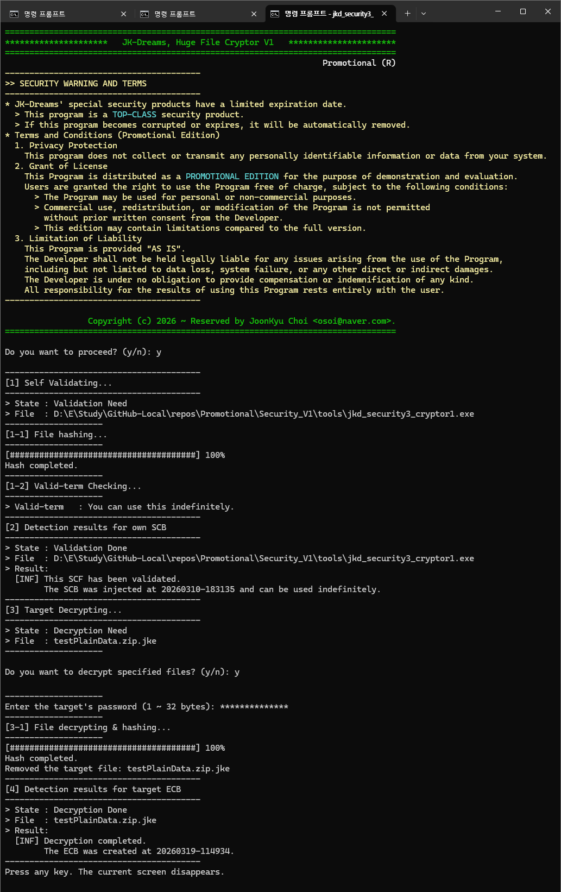

# 3급 보안 암복호툴 (jkd_security3_cryptor1.exe)

보안 데이터가 포함된 파일을 전달하거나 보관할 때, 사용하기 위한 3급 보안툴이다.</br>
기업용은 `2급 보안`으로 사용하지만, 패스워드 없이 무기한 사용이 가능한 `3급`으로 재설정하여, 홍보용으로 공개한 것이다.
> 명칭
  - 암복호툴
> 내장 기능
  - 자체 SCB 검증
  - 대상 암복호화
    > 이미 암호화된 파일은 복호화를 수행한다.
> 특징
  - 대용량 파일을 빠르게, 암복호 처리할 수 있도록 설계되었다.
  - 주로, 2급은 전달용으로 사용하고, 3급은 보관용에 사용한다.</br>
    본 툴의 원본 파일을 복제하여, 3급으로 주입시켜 사용할 때가 많다.
  - 특히, 홍보용 버전은 패스워드를 적용하지 않고, 무기한 사용해야 하기에, 3급으로 주입하여 공개한다.


## 캡쳐 화면들

### 자체 검증 화면
패스워드 없이, 무기한 사용으로 설정된 홍보용 버전이다.</br>
```bash
$ jkd_security3_cryptor1
```


### 대상 암호화 장면
패스워드 지정, 원본파일 삭제 옵션으로, 대상 파일을 암호화 시키는 장면이다.</br>
```bash
$ jkd_security3_cryptor1 testPlainData.zip -d
```


### 대상 복호화 장면
패스워드 입력, 원본파일 삭제 옵션으로, 대상 파일을 복호화 시키는 장면이다.</br>
```bash
$ jkd_security3_cryptor1 testPlainData.zip.jke -d
```



## 보안 경고와 약관
```
* JK-Dreams의 특수한 보안 제품에는 유효기간이 정해져 있습니다.
  > 본 프로그램은 최고급 보안 제품입니다.
  > 본 프로그램이 손상되거나 만료되면, 자동으로 제거됩니다.
* 이용 약관 (프로모션 에디션)
  1. 개인정보 보호
    본 프로그램은 귀하의 시스템에서, 어떠한 개인 식별 정보나 데이터를 수집하거나 전송하지 않습니다.
  2. 라이센스 부여
    본 프로그램은 시험적·평가적 목적으로, 프로모션 에디션으로 배포됩니다.
    사용자에게는 다음 조건에 따라, 프로그램을 무료로 사용할 수 있는 권리가 부여됩니다.
      > 본 프로그램은 개인적 또는 비상업적 목적으로 사용될 수 있습니다.
      > 개발자의 사전 서면 동의 없이는 프로그램의 상업적 사용, 재배포 또는 수정이 허용되지 않습니다.
      > 본 버전은 정식 버전에 비해, 제한 사항이 있을 수 있습니다.
  3. 책임의 제한
    본 프로그램은 "있는 그대로" 제공됩니다.
    개발자는 프로그램 사용으로 인해 발생하는 데이터 손실, 시스템 오류 또는 기타 직간접적 손해를 포함하되,
    이에 국한되지 않는 모든 문제에 대해, 법적 책임을 지지 않습니다.
    개발자는 어떠한 종류의 보상이나 면책도 제공할 의무가 없습니다.
    본 프로그램의 사용 결과에 대한, 모든 책임은 전적으로 사용자에게 있습니다.
```
