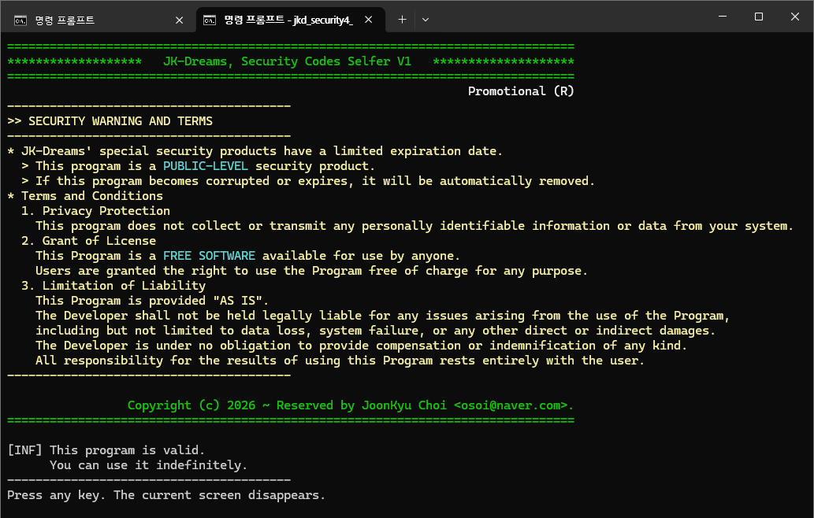

# 4급 보안 자체검증 데모 (jkd_security4_selfer1.exe)

실행 가능한 이진코드 파일들(exe, dll)에, SCB가 내장된 라이브러리를 적용한, 자체검증 4급 보안 예제 어플이다.</br>
`jkd_security3_selfer1_core.lib`를 내장하여 빌드한 결과물은 비활성 상태인, SCF가 만들어 진다.</br>
`jkd_security3_selfer1_core.lib`는 비활성 상태의 SCB가 내장된 모듈에 해당하고, 본 데모는 SCF에 해당한다.</br>
빌드된 결과물인 SCF는 비활성 상태이기 때문에, 주입툴(jkd_security3_injector1.exe)로 SCB를 활성화 시켜야 한다.
> 명칭
  - 자체검증 데모
> 내장 기능
  - 자체 SCB 검증 (초간단 검증)
> 특징
  - `jkd_security3_selfer1_core.lib`를 사용하여, SCB가 내장된 보안 프로그램을 개발하기 위한, 예제용 프로그램이다.</br>
    `jkd_security3_selfer1_core.lib`를 활용한, 추가적인 보안 프로그램 개발 방법을 보여주기 위한 예제다.
  - SCB가 내장되었다는 것은, **데이터 무결성 검증** 기능이 포함된 것이며, 제공하는 함수 호출로 검증을 수행시킬 수 있다.


## 캡쳐 화면들

### 자체 검증 화면
패스워드 없이, 무기한 사용으로 주입된 자체검증 화면이다.</br>



## 보안 경고와 약관
```
* JK-Dreams의 특수한 보안 제품에는 유효기간이 정해져 있습니다.
  > 본 프로그램은 공개 수준의 보안 제품입니다.
  > 본 프로그램이 손상되거나 만료되면, 자동으로 제거됩니다.
* 이용 약관
  1. 개인정보 보호
    이 프로그램은 귀하의 시스템에서, 어떠한 개인 식별 정보나 데이터를 수집하거나 전송하지 않습니다.
  2. 라이센스 부여
    이 프로그램은 누구나 사용할 수 있는 무료 소프트웨어입니다.
    사용자에게는 어떤 목적으로든 프로그램을 무료로 사용할 수 있는 권리가 부여됩니다.
  3. 책임의 제한
    본 프로그램은 "있는 그대로" 제공됩니다.
    개발자는 프로그램 사용으로 인해 발생하는 데이터 손실, 시스템 오류 또는 기타 직간접적 손해를 포함하되,
    이에 국한되지 않는 모든 문제에 대해, 법적 책임을 지지 않습니다.
    개발자는 어떠한 종류의 보상이나 면책도 제공할 의무가 없습니다.
    본 프로그램의 사용 결과에 대한, 모든 책임은 전적으로 사용자에게 있습니다.
```
