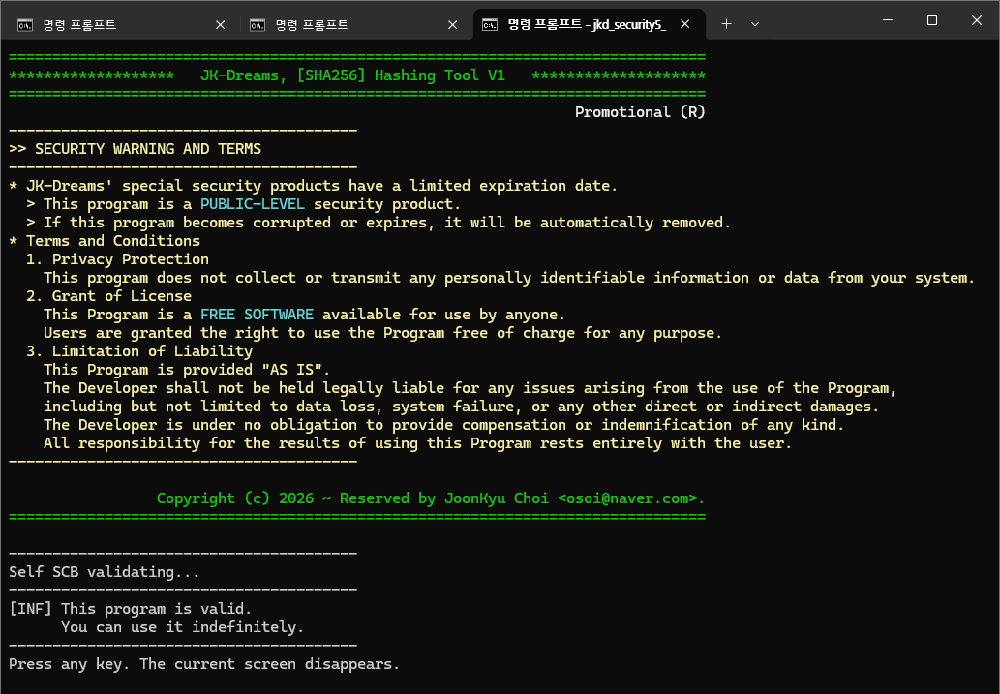
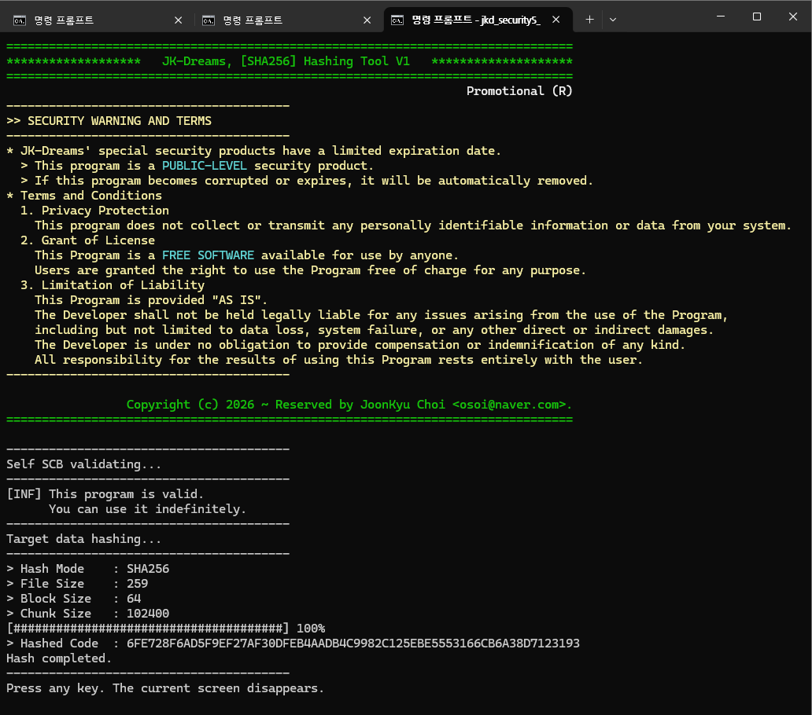

# 5급 보안 해시툴 (jkd_security5_sha256.exe)

SHA256 알고리즘을 사용한, 공개용 5급 보안툴로써, **대용량 파일 해시** 프로그램이다.
> 명칭
  - SHA256 거대파일 해시기
> 내장 기능
  - 자체 SCB 검증 (초간단 검증)
  - 대상 파일 해시(결과코드 파일 생성)
> 특징
  - `jkd_security3_selfer1_core.lib`를 내장시켜 개발되었다.
  - 결과코드 파일의 명칭은 `대상파일명.sha256` 형식이다.


## 캡쳐 화면들

### 자체 검증 화면
패스워드 없이, 무기한 사용으로 주입된 자체검증 화면이다.</br>
```bash
$ jkd_security5_sha256
```


### 대상 해시 화면
지정한 대상 파일을 해시하는 화면이다.</br>
```bash
$ jkd_security5_sha256 testPlainData.zip
```



## 보안 경고와 약관
```
* JK-Dreams의 특수한 보안 제품에는 유효기간이 정해져 있습니다.
  > 본 프로그램은 공개 수준의 보안 제품입니다.
  > 본 프로그램이 손상되거나 만료되면, 자동으로 제거됩니다.
* 이용 약관
  1. 개인정보 보호
    이 프로그램은 귀하의 시스템에서, 어떠한 개인 식별 정보나 데이터를 수집하거나 전송하지 않습니다.
  2. 라이센스 부여
    이 프로그램은 누구나 사용할 수 있는 무료 소프트웨어입니다.
    사용자에게는 어떤 목적으로든 프로그램을 무료로 사용할 수 있는 권리가 부여됩니다.
  3. 책임의 제한
    본 프로그램은 "있는 그대로" 제공됩니다.
    개발자는 프로그램 사용으로 인해 발생하는 데이터 손실, 시스템 오류 또는 기타 직간접적 손해를 포함하되,
    이에 국한되지 않는 모든 문제에 대해, 법적 책임을 지지 않습니다.
    개발자는 어떠한 종류의 보상이나 면책도 제공할 의무가 없습니다.
    본 프로그램의 사용 결과에 대한, 모든 책임은 전적으로 사용자에게 있습니다.
```
